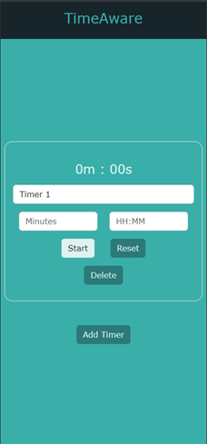
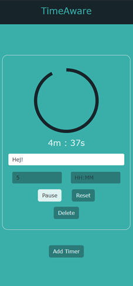
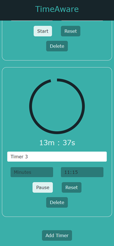
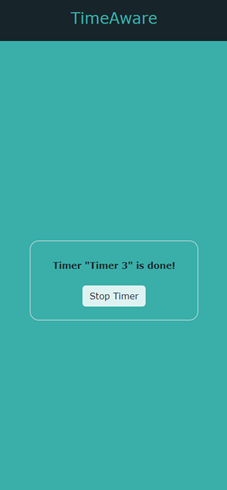

# TimeAware

TimeAware is a web application designed to assist individuals with time blindness, a common challenge among those with ADHD/ADD. The application aims to improve users' ability to plan and manage time through interactive and visual aids, specifically catering to mobile devices. This project was developed as part of a thesis project in the course 1DV50E Datavetenskap, självständigt arbete (högskoleexamen) (Computer Science, Independent Project (Higher Education Certificate)) at Linnaeus University by Maria Fredriksson, under the supervision of Daniel Toll. 

## Features

- **Visual Timer**: Create timers that count down to specific times or for set durations.
- **Notification System**: Receive alerts when timers complete.
- **Interactive Interface**: Update timer names and times interactively.
- **Mobile-first Design**: Optimized for use on mobile devices with a responsive layout.

## Tech Stack

- **Frontend**: React, JavaScript, HTML, CSS
- **Styling**: Bootstrap for responsive design elements.
- **Deployment**: Hosted on Netlify, linked directly to the main branch of the GitHub repository.

## Deployment
The TimeAware application is deployed and accessible at this following link on Netlify - [https://timeaware.netlify.app/](https://timeaware.netlify.app/)
This link leads to the live web application where users can interact with the app on any web browser. However, the application is optimized for mobile devices and is best experienced on a smartphone.

## Documentation
Detailed documentation about the project is available in the project wiki on GitHub at this link - [https://github.com/upend0/TimeAware/wiki](https://github.com/upend0/TimeAware/wiki). In the wiki, one can find information (in Swedish) about the project and its development process, including sprint backlogs, pitch presentation, requirements specification, test specification, and final thesis.

## Application Views
TimeAware is a single-page application (SPA) that dynamically updates based on user interactions. Below are the various views of the application as the user engages with it:

### Home View
Upon launching the app, users are greeted by the Home View where they can immediately interact with the timer functionalities.




### Timer Active View
When a timer is set, the view shifts to show the countdown visually with a circle that decreases as time passes. The time can be set to either a specific time or a duration. Users can also pause and resume the timer, or pause and edit the timer. Timers can also be added and deleted, and the name of the timer can be changed.






### Timer Completion Notification
Once a timer completes, the application displays a notification, informing the user that the timer named has finished.




## Setup

To set up the project locally, follow these steps:

1. **Clone the Repository**
   ```bash
   git clone https://github.com/upend0/TimeAware.git
   ```
2. **Install Dependencies**
   ```bash
   cd timeaware
   npm install
   ```
3. **Run the Application**
   ```bash
   npm start
   ```

The application will be available at `http://localhost:3000` in your web browser.

## Usage

1. **Create a Timer**: Use the "Add Timer" button to create a new countdown.
2. **Set Timer**: Click on a timer to set a specific time or duration.
3. **Start/Stop Timer**: Use the start/stop button to control the timer.
4. **Notifications**: Notifications will appear in the app when a timer completes.

## Contributing

Contributions to TimeAware are welcome. Please fork the repository and submit a pull request with your changes. For major changes, please open an issue first to discuss what you would like to change.

## License

This project is licensed under the MIT License - see the [LICENSE.md](LICENSE) file for details.

## Acknowledgments

- **Supervisor**: Daniel Toll
- **University**: Linnaeus University
- **Framework**: React documentation and community

## Future Work

- Enhance the reliability of the application when not actively used on a mobile phone.
- Implement additional functionalities as outlined in the future development sections of the thesis.
